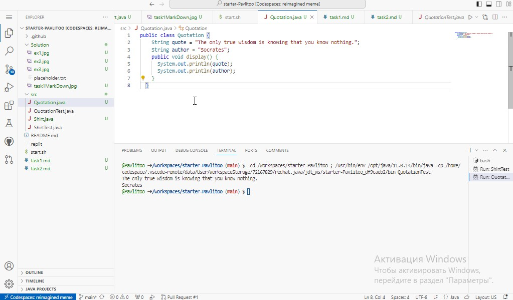

# Всі завдання

## ShirtTest

#### Моє перше завдання (думаю я виконав на 5/5)

```java
public class ShirtTest {

    public static void main(String args[]) {
        Shirt myShirt = new Shirt();
        myShirt.displayShirtInformation();
    }
}

```


## Shirt

```java
public class Shirt {
    public int shirtID = 1;
    public String description = "firstDeveloper";
    // Кольори: red, blue, green, unset
    public String colorCode = "R";
    public double price = 15.0;
    public int quantityInStock = 150;

    public void displayShirtInformation() {
        System.out.println("Shirt ID: " + shirtID);
        System.out.println("Shirt description: " + description);
        System.out.println("Color Code: " + getColorString());
        System.out.println("Shirt price: $" + price);
        System.out.println("Quantity in stock: " + quantityInStock);
    }

    private String getColorString() {
        // Перевіряємо значення colorCode і повертаємо відповідний рядок
        switch (colorCode) {
            case "R":
                return "red";
            case "B":
                return "blue";
            case "G":
                return "green";
            default:
                return "unset";
        }
    }
}

```


# QuotationTest

```Java
public class QuotationTest {
    public static void main(String args[]) {
        Quotation myQuotation = new Quotation();
        myQuotation.display();
    }
}

```


# Quatation

```Java

public class Quotation {
    String quote = "The only true wisdom is knowing that you know nothing.";
    String author = "Socrates";
    public void display() {
      System.out.println(quote);
      System.out.println(author);
    }
  }

```



## Цитата

> The only true wisdom is knowing that you know nothing.

*Автор: Socrates*


## [Мій GitHub](https://www.example.com)


*Автор роботи: Луговий Павло 34  PPC NTU "KhPI"*

