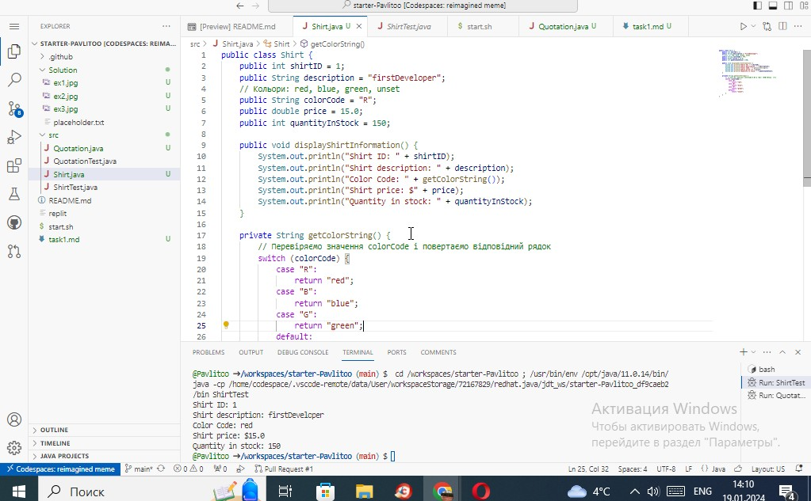

# QuotationTest

```Java
public class QuotationTest {
    public static void main(String args[]) {
        Quotation myQuotation = new Quotation();
        myQuotation.display();
    }
}

```


# Quatation

```Java

public class Quotation {
    String quote = "The only true wisdom is knowing that you know nothing.";
    String author = "Socrates";
    public void display() {
      System.out.println(quote);
      System.out.println(author);
    }
  }

```



## Цитата

> The only true wisdom is knowing that you know nothing.

*Автор: Socrates*


## [Мій GitHub](https://www.example.com)


*Автор роботи: Луговий Павло 34  PPC NTU "KhPI"*

